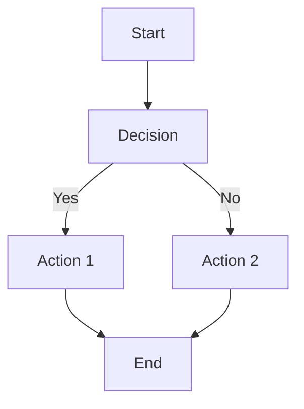
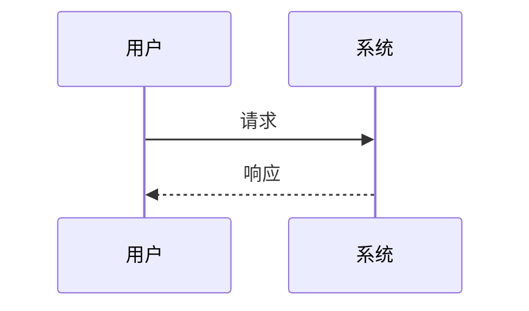
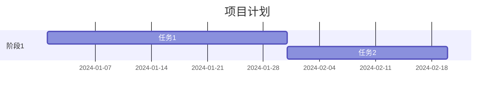
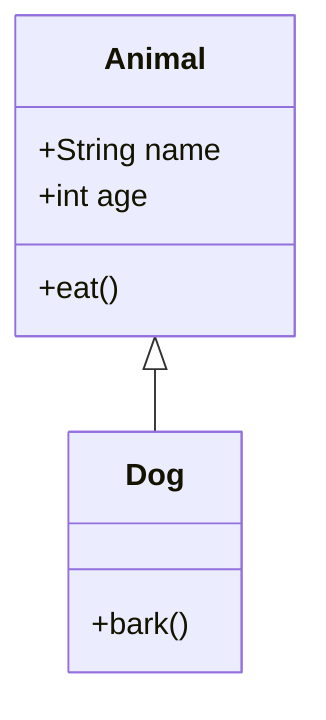
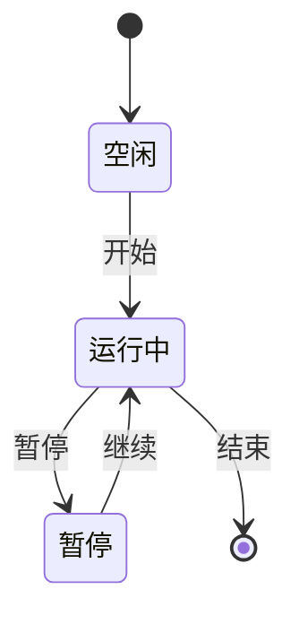

# Mermaid 使用说明

你的 Jekyll 网站现在已经支持 Mermaid 图表了！

## 使用方法

在 Markdown 文件中，使用代码块格式，语言标识符设置为 `mermaid`：

````markdown

````

## 支持的图表类型

Mermaid 支持多种图表类型，包括：

### 流程图 (Flowchart)


### 序列图 (Sequence Diagram)


### 甘特图 (Gantt Chart)


### 类图 (Class Diagram)


### 状态图 (State Diagram)


## 注意事项

- Mermaid 代码块必须使用 `mermaid` 作为语言标识符
- 图表会在页面加载时自动渲染
- 如果图表没有显示，请检查浏览器控制台是否有错误

