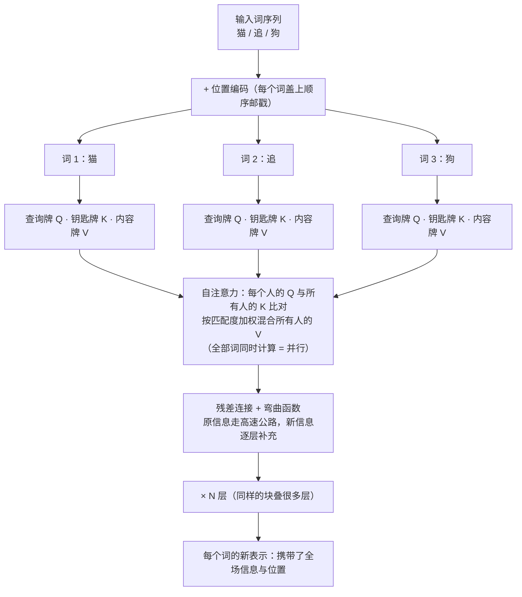

前段时间给朋友的孩子讲了些关于 ai 的基本知识。沿着这个思路，我做了一些整理。

## 背景

面向初中的孩子，刚刚学了一点方程组和函数的概念，知道二元一次方程组和一元二次方程。知道平面直角坐标系。我们会从人工智能的目的，发展路径和主流发展的现状来展开。

## 什么是人工智能

作为万物灵长的人类，能否创造出像人一样有心智和思考能力的存在？这最初是一个哲学问题，并没有和数学或计算机关联在一起。最早出现在文学想象的“人创造智慧”，通常是和具体的人形造物关联在一起。

在有神论盛行的时代，神创造人，被人广泛接受，那么，人能否像神一样，创造出会思考的存在？这成为了一个非常重要的哲学问题。

人工智能并不是计算机发展的产物，相反，某种意义上说，计算机科学是数学家为了回答人工智能这个哲学问题而创造的工具。

1900年，当时世界上最伟大的数学家，大卫·希尔伯特，在巴黎国际数学家大会上提出了二十三个问题，希望为二十世纪的数学指明方向。1920年代，他又进一步提出了希尔伯特纲领（Hilbert's Program）：把全部数学形式化，并一劳永逸地奠定数学的基础，消除一切歧义和含糊。这个纲领中包含一个后来影响深远的问题——判定问题（Entscheidungsproblem）：是否存在一个算法，对任意数学命题，都能在有限步内判定它是否可证？

“我们必须知道，我们终将知道”——大卫·希尔伯特

图灵 1936 年的论文《可计算数及其在判定性问题上的应用》，通常被视作信息科学与技术的起点，而这篇论文在学术上，被认为是对判定问题的有力回答——不存在一个算法可以在有限步内判定任意的数学命题。

这篇论文宣判了可判定问题的终结，也宣告了现代的计算机科学的开始。紧跟着这篇论文
- 1945 年，冯诺伊曼提出了冯诺伊曼架构（存储程序计算机），为今日几乎所有计算机奠定了体系结构
- 1948 年，维纳创立了控制论，今天所有赛博开头的流行文化概念，都来自维纳创造的这个词 Cybernetics
- 1948 年，香农创立了信息论，从此奠定了对信息的度量

在这一系列足以写入人类历史的开创性工作之后，1956年，达特茅斯会议，为这个时代带来了一个高潮，也是一个新时代的起始。

四位发起人

* 约翰·麦卡锡（John McCarthy，达特茅斯，28 岁）——后来发明 Lisp、获 1971 年图灵奖，是"AI"一词的铸造者；
* 马文·明斯基（Marvin Minsky，哈佛，27 岁）——后来的《感知机》作者、MIT AI 实验室联合创始人；
* 克劳德·香农（Claude Shannon，贝尔实验室，39 岁）——信息论创立者，四人中最负盛名者；
* 纳撒尼尔·罗切斯特（Nathaniel Rochester，IBM，37 岁）——IBM 701 主设计师，工业界代表。

提出了

> 「我们将研究这样一个猜想：学习的每个方面或智能的任何特征，原则上都可以被精确描述到可以用机器来模拟的程度。」

> （The study is to proceed on the basis of the conjecture that every aspect of learning or any other feature of intelligence can in principle be so precisely described that a machine can be made to simulate it.）

在这次学术会议上，麦卡锡提出了`Artificial Intelligence`人工智能这个概念。

而学习，成为了人工智能的核心概念。

从能力来看，人工智能总是一种可以根据反馈自我校准的系统，这个校准的过程我们称之为学习，这也是现在我们看到各种名字中带有学习的算法的来由。而这个预测-反馈-修正的基本框架，来自控制论开创的道路。

从目标来看，人工智能总是在寻找复杂问题的最优解，这在数学上归于古老又年轻的最优化理论。最优化理论已经成为AI发展的基石之一。

需要注意的是，很多问题我们无法得到理想的最优解，最优化计算实际追求的，通常是“尽可能好”甚至是“尽可能不坏”的问题。

最优化的起源可以上溯到人类的古代社会，数学刚刚萌芽的时期。随着数学的加速发展，最优化也有了崭新的面貌。

现代最优化问题要解决的，通常是要在复杂的数学空间中，寻找问题函数“最低的那个平底”。经典的基本方法可以概括为三步：
- 计算函数的导数，
- 寻找导数为零的点，
- 在这些点中比较函数值，找到最低的位置

需要注意的是，导数为零的位置可能是最低点，也可能是最高点，还可能只是一段平坦的坡，所以需要比较确认。

这个过程天然的契合了AI算法中，寻找“最小损失”，从而找到最优的函数状态的训练过程，也契合了“在信息空间中检索最优反馈”的基本推理原则。这使得最优化理论成为现代机器学习算法的基石。

## 连接学派——从万能近似公式到LLM

### 连接学派和符号学派的分歧

达特茅斯会议之后，研究者很快分成了两条道路。

**符号学派**认为，智能的本质是符号的逻辑运算。他们主张把知识用规则写进机器：如果 A 则 B，推理就像做几何证明题一步推一步。1956 年会议上纽厄尔和西蒙展示的「逻辑理论家」、后来 1960 年代的「通用问题求解器」，以及 1970–80 年代盛极一时的专家系统，都是这条路的产物。

**连接学派**则从大脑得到启发：人脑里没有规则，只有约 860 亿个神经元，每个神经元做的工作非常简单——接收上游传来的电信号，累加，超过阈值就向下游放电。智能从这亿万次简单连接的协作中涌现。1943 年麦卡洛克和皮茨提出了第一个神经元数学模型；1949 年心理学家赫布提出「一起放电的神经元连接会增强」（赫布学习律），为学习提供了第一个机制猜想；1957 年罗森布拉特在 IBM 计算机上实现了**感知机**（Perceptron）——一个可以自己学习分类的神经元模型，一度登上《纽约时报》头条。

两条路的分歧可以概括为：符号学派想**自上而下地把智能写出来**，连接学派想**自下而上让智能长出来**。

### 万能近似公式的坎坷道路

连接学派的心脏是一条数学定理。**1989 年，Cybenko 与 Hornik 分别证明了万能近似定理**：只要神经元足够多，一个单隐层神经网络原则上可以逼近任意连续函数——也就是说，它能表达的规律，原则上不逊于任何函数。

我们先弄懂这条定理在说什么。为此需要一个新工具——矩阵，但它其实就藏在你学过的二元一次方程组里。

解方程组 $\begin{cases} 2x + 3y = 8 \\ 4x - y = 2 \end{cases}$ 时，真正起决定作用的是什么？是未知数前面的**系数排成的方阵**，和等号右边的数字。数学家把这个结构单独拎出来写：

$$\begin{pmatrix} 2 & 3 \\ 4 & -1 \end{pmatrix} \begin{pmatrix} x \\ y \end{pmatrix} = \begin{pmatrix} 8 \\ 2 \end{pmatrix}$$

中间那个括起来的数表就叫**矩阵**。它不再是「解方程的草稿」，而是一个独立的数学对象：给定一组输入 $(x, y)$，矩阵会按固定的方式把它们**组合成一组输出**——第一个输出是 $2x + 3y$，第二个是 $4x - y$。矩阵就是对「一套固定的组合规则」的紧凑记法。

现在看一个人工神经元在做什么。它收到若干输入信号，给每个信号分配一个重要程度（**权重**，可正可负），加权求和，再加上一个自身的偏置，最后通过一个「点火函数」决定输出多少。设输入是 $(x, y)$，一个神经元计算的正是：

$$a = f(w_1 x + w_2 y + b)$$

——去掉记号的外衣，这就是方程组里的**一个方程**：系数对应权重，常数项对应偏置。一层神经元合在一起，就是把输入向量左乘一个权重矩阵。所以「一层神经网络」本质上是：**矩阵乘法 + 每个神经元各自做一次非线性弯曲**（$f$ 通常是把大数压到接近 1、小数压到接近 0 的 S 形函数，正是这个弯曲提供了表达能力）。

万能近似定理说的就是：把这样的层叠起来，只要中间的神经元**足够多**，整个网络能以任意精度逼近任何一条连续的曲线、任何一个连续的输入输出关系。直觉版本可以这样理解：S 形函数是光滑的「台阶」，把许多高低不同、位置不同的台阶加权叠加，可以拼出台阶、斜坡、山谷——就像用足够多的小方砖，能铺出任意弯曲的路面。而「权重该取多大、台阶摆在哪里」，不需要人手工设计，这正是反向传播算法通过「预测-反馈-修正」自动学出来的东西。

但「原则上存在」和「实际上能学到」之间隔着一条鸿沟，连接学派为此跌撞了三十年：

- **1969 年**，明斯基和帕珀特出版《感知机》，数学上严格证明了单层感知机连「异或」这样的简单逻辑都学不会。这本书几乎冻结了连接学派的经费，加上符号学派的专家系统如日中天，AI 迎来第一次寒冬（1974–1980）。
- **1986 年**，鲁梅尔哈特、辛顿和威廉姆斯系统推广了**反向传播算法**（backpropagation）：用链式法则把误差逐层回传，逐个修正连接权重。多层网络终于可以训练了，连接学派强势复苏。
- **1991 年**，霍克赖特指出**梯度消失**问题：网络越深，回传的信号越弱，深层网络几乎学不动。复兴再次受挫，加上符号学派专家系统的商业失败，AI 跌入第二次寒冬（约 1987–1993）。

这条「证明可行 → 被证伪局部 → 算法突破 → 再遇障碍」的坎坷道路，正是「尽可能好」式寻优的注脚。

### 从循环神经网络到 Transformer

万能近似定理说「一层足够宽就能表达一切」，但实践给出了一个反直觉的答案：**宽不如深**。同样数量的神经元，摊成一层很宽的网络，效果远不如叠成许多层——因为真实世界的规律是分层的：识别一张猫的照片，底层神经元学会认「边缘和线条」，中层把线条拼成「耳朵、眼睛的轮廓」，高层再把轮廓组合成「猫脸」。层数越多，每一层只需在上一层的成果上做一点抽象，就像课文从「字」到「词」到「句」到「中心思想」的逐级概括。把网络做「深」，因此成了连接学派的共同方向——「深度学习」中的「深度」，指的就是层数。

看图像的场合，还催生了一种关键的专门结构。用全连接网络看图有个荒谬之处：一张 1000×1000 的照片有一百万个像素，若每个像素都和第一层每个神经元相连，权重的数量会大到没法训练，而且这样的网络认猫必须「死记」猫在每个位置的样子——猫挪一步就认不得了。**1980 年**，福岛邦彦提出「新认知机」，给出了生物启发的雏形；**1989–1998 年**，杨立昆把它发展成**卷积神经网络**（CNN）：让一个小的权重模板（卷积核）像盖章一样扫过整张图——同一套「边缘检测器」在所有位置复用，权重数量骤减，而且天生不挑位置。1998 年的 LeNet-5 已被银行用于识别支票上的手写数字。但深层 CNN 同样被训练难度压了十几年，直到 2012 年 AlexNet 借助 GPU 的算力在 ImageNet 竞赛中一举夺魁（后面还会讲到它），深度学习才真正起航。CNN 的思路——**让权重模板在空间中复用**——与后来注意力机制「让权重随内容动态生成」形成有趣的对照，两者在 Transformer 中合流。

而在语言、语音这类序列数据的场合，网络结构的演进走的是另一条线索：

- **1982 年**，物理学家霍普菲尔德提出 Hopfield 网络，把统计物理能量极小的思想引入神经网络（他因此与辛顿分享 2024 年诺贝尔物理学奖）。
- **1990 年**，埃尔曼提出循环神经网络（RNN）：让网络的输出接回输入，用「内部状态」记住上文。
- **1997 年**，霍克赖特与施密德胡伯提出**长短期记忆网络**（LSTM）：给记忆加上「门」来决定记什么、忘什么，缓解梯度消失，此后二十年统治语音识别与机器翻译。
- **2014 年**，苏茨克维等人提出 seq2seq（序列到序列）框架，把翻译变成「读入编码、解码输出」；同年巴丹瑙为它加上**注意力机制**：翻译每个词时，允许模型回头看原文中最相关的部分，而不必把整句压进一个固定向量。
- **2017 年 6 月**，谷歌团队发表论文《Attention Is All You Need》，提出 **Transformer**：干脆丢掉循环，全靠注意力并行处理整个序列。训练可以大规模并行，这一架构成为此后几乎所有大模型的底座。

Transformer 是这些有记忆神经网络的集大成者。

前面说过，一层神经网络就是「矩阵乘法 + 弯曲」。但那个矩阵的个头是固定的：输入多长，权重就得排多长——句子里有 20 个词就得为 20 个词的位置各配一套权重，来一个 100 词的句子整个网络就作废重造。更糟的是它没有「顺序」概念：把「猫追狗」和「狗追猫」的词打乱了喂进去，输出完全一样。

而语言，是基于语音的演化结果，时序是语言的一部分。RNN 用「输出接回输入」解决了顺序问题，但代价惨重：必须一个词一个词算完才能算下一个，快不了；而且回忆第一千个词要经过九百九十九步传递，梯度消失让远距离记忆几乎学不动——LSTM 的「门」只是缓解，没有根治。

**Transformer 换了一个思路：不再接力传递记忆，而是让每个词直接查看所有词。**这就是「自注意力」。想象教室里每个同学（词）手里都有一个探照灯：他先亮出自己的**内容牌**（「我是一个动词，正在找它的宾语」），又举一块**查询牌**（「我在找名词」），还需要一块**钥匙牌**（「我是名词」）供别人比对。每个同学拿自己的查询牌和全场每个人的钥匙牌比对一遍，越匹配的给越高的关注权重，然后把大家的内容牌按这个权重加权混合，作为自己更新后的表示。「猫追狗」里，「追」的查询牌会强烈匹配「猫」和「狗」的钥匙牌——主语和宾语信息被一步拉到跟前，不需要任何接力。

用一张图概括 Transformer 处理「猫 追 狗」的机制：

回到我们熟悉的语言：**注意力本质上就是一套加权求和**——和神经元做的事情同构，只不过权重不再由训练一次定死，而是**每次都由当前句子现场计算**。这就是 Transformer 携带「记忆」的真正含义：它不是把上文存进一个仓库，而是**每处理一个词就把全部上文重新加权混合一遍**——记忆不是被储存的，而是被当场检索的。所谓「上下文」，就是每次都翻检全部历史、按相关性取用的动态笔记本。

**那它为何可以训练？**关键在并行与短路。RNN 一步依赖上一步，一千个词就是一千道必须依次通过的关卡，误差回传要走一千步，步步衰减；Transformer 里每个词与每个词**直接相连**——第一千个词要看第一个词，一步直达，误差也是一步回传，梯度消失的病根被连根拔掉。同时所有词的注意力可以同时计算（一个大矩阵乘法，正是 GPU 最擅长的事），训练速度不再受序列长度绑架。再配上残差连接（每层只学「在原有表示上补充什么」，原信息走高速公路直通顶层）和位置编码（给每个词盖一个表示顺序的邮戳，弥补丢弃循环后失去的顺序感），Transformer 把「能表达」「能记住」「能训练」三件事一次性凑齐——大模型时代的大门由此打开。

### 基于注意力机制的现代 LLM

Transformer 之后的路线，就是大家熟悉的大模型编年史：

- **2012 年**（前奏），辛顿团队的 AlexNet 在 ImageNet 图像识别竞赛中大幅领先，深度学习复兴的标志事件；
- **2018 年 6 月**，OpenAI 发布 GPT-1；**2018 年 10 月**谷歌发布 BERT——「预训练 + 微调」范式确立：先在海量文本上自监督学习，再适配具体任务；
- **2020 年 5 月**，GPT-3（1750 亿参数）：规模大到无需微调，看几个示例就能做题（上下文学习）；
- **2022 年 1 月**，InstructGPT 论文确立 **RLHF**（人类反馈强化学习）：用人类偏好校准模型行为——「预测-反馈-修正」闭环的当代实现；
- **2022 年 11 月 30 日**，ChatGPT 上线，两个月内用户破亿，大模型走入公众生活；
- **2023 年 3 月**，GPT-4 发布，多模态能力显著提升；同期开源社区迎来 LLaMA 系列等开放权重模型。

### 从模型到完整的 Agent 生态

最后一步演化，是让模型从「问答」走向「做事」——能调用工具、多步执行的智能体（Agent）：

- **2022 年 10 月**，ReAct 论文提出让模型把「推理」与「行动」交错进行：想一想，做一步，看结果，再想；
- **2023 年**，OpenAI 发布 Function Calling，模型可以按约定格式调用外部函数；同年开源社区出现 AutoGPT 等自主 Agent 尝试；
- **2024 年 11 月**，Anthropic 发布 **MCP**（Model Context Protocol），为模型连接外部工具与数据源提供统一协议，Agent 生态开始标准化；
- **2024–2025 年**，推理模型（如 o1、DeepSeek-R1）出现：让模型在回答前先展开长链条的内部思考，把「预测-反馈-修正」搬进了推理阶段本身。

至此，从 1943 年一个神经元的数学模型，到能看、能说、能使用工具完成任务的 Agent 生态，连接学派用八十年时间，把「学习」从哲学猜想变成了工程现实。