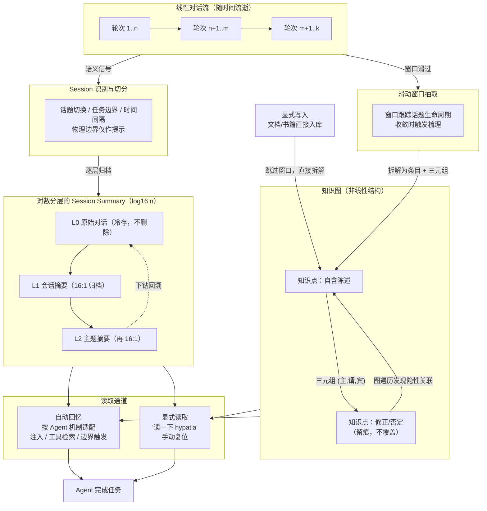

webway 一文里我提到，hypatia 对我几乎是无感的。但无感并不等于无事发生。恰恰相反，每一段对话结束之后，都有一个整理的过程在运转：把线性的、随时间流逝的对话记录，转化为非线性的、可以长期检索的知识结构。这篇文章就专门讨论这件事。

对话天然是线性的。一句接一句，上下文沿着时间轴展开，这让"读懂当前这一句"变得容易，却让"半年后还记得你说过什么"变得几乎不可能。Context Length 的增长缓解了前者，但没有触碰后者。无限记忆的本质问题从来不是"能装下多少"，而是"装下的东西还能不能被找到、被理解、被关联"。所以我的答案一直是：不要试图保存对话本身，要保存对话中被整理出来的知识。

## Session 的识别与切分

在整理之前，先要回答一个更基本的问题：什么是一个 session？

粗看起来这不成问题——Agent 框架大多有明确的会话边界，一次启动到一次退出，就是一段对话。但拿这个边界直接当作 session 的定义，整理出来的东西会很难看。一次会话里可能换了三个毫不相干的话题，而同一个任务又可能横跨好几次会话的重启。整理的单位如果错了，后面所有的摘要和抽取都会对着错误的对象工作。

所以 hypatia 切分 session 靠的是语义信号，而不是框架给的物理边界：

- **话题切换**是最强的信号。窗口内的讨论从 sqlite 存储跳到了集群运维，无论框架层面是否还是同一个会话，它们都该被切成两段。
- **任务边界**是次强信号。一个明确的交付完成（代码合入、文档写完、问题被解决）通常意味着一段叙事的自然终结。
- **时间间隔**是最弱的信号。中断了一夜之后的继续，即使上下文还连着，也值得检查是否应该切开。

物理边界（进程重启、新会话 ID）则被当作提示而非定义：碰到它时检查最近的内容是否已经收敛，收敛了就顺势切分，没收敛建议合并到下一段去处理。

切分的粒度没有唯一正确的答案，我的准则是：**一个 session 应该恰好容纳一个可以独立陈述的主题**。它要小到摘要时不至于被迫丢弃异质的信息，又要大到滑动窗口有足够的空间等待话题收敛。切分本身也不追求一次定终身——既然低层原文总在，切错了的边界在更高层归档时还有机会被重新缝合。识别错误是可修复的，不识别才是不可修复的。

## 对数空间的 session summary

线性记录的第一问题是体积。如果一个 session 的摘要和原对话一样长，那摘要就毫无意义。

hypatia 的 session summary 遵循一个朴素的目标：**log₁₆(n) 的空间代价**。也就是说，十六份原始对话，最终归档为一份量级相当的摘要；而十六份这样的摘要，再归档为一份更高层级的摘要。每上升一层，信息被压缩十六倍，但被压缩的是叙事和过程，不是结论。

这和人们熟悉的高层次 summary 不同，我不是让模型"读完一万字写出两百字"——那种一次性压缩的信息损失是不可控的。分层归档意味着每一层的压缩都只面对上一层的产物，每一次压缩的输入都是已经被梳理过的、密度更高的内容。损失当然存在，但它发生在每一层的边缘，而不是一次性的坍塌。低层的原文并不删除，只是不再处于热路径上：当你需要精确回溯某句话时，可以从高层摘要逐层下钻，代价是每下一层多一次检索。这本质上和 B 树的逻辑一样——你不指望根节点存住所有数据，你指望的是从根节点出发总能找到数据。

## 滑动窗口与知识点的梳理

压缩之外，更关键的是抽取。对话进行中，hypatia-memory 以一个**滑动窗口**跟踪对话历史：窗口内的内容是待整理的候选，窗口滑过的内容是已归档的既成事实。

窗口的意义在于节奏。知识点不是每句话都产生的，往往一段十轮的讨论才沉淀出一个结论。窗口太短，会把过程中的猜测和已被推翻的尝试误当成知识写入；窗口太长，整理的时机又总是姗姗来迟。我的实践是让窗口覆盖"一个完整话题的自然生命周期"——当窗口内的讨论出现收敛迹象（结论被确认、话题被切换），才是梳理的时机。

梳理的产物是**知识点**：一条自含的、脱离对话上下文仍然成立的陈述。"用户说要用 sqlite 换掉 duckdb"不是知识点，那是聊天记录；"存储层评估过 sqlite 单库方案，因 json contains 查询不可行而搁置"才是知识点。前者只有在那段对话的语境里才有意义，后者可以在任何时候被检索到并直接使用。梳理时还需要做一次裁决：这条知识是新的，还是对既有知识的修正或否定？修正会更新条目，否定会留下冲突的痕迹而不是悄悄覆盖——记忆系统最忌讳的就是悄悄忘记自己曾经知道什么。

在"记什么、怎么记"上，hypatia-memory 积累了几条主要的提取原则：

- **记录教训，而不是流水账。** 梳理是合成，不是转录。压缩的对象是叙事和过程，保下来的是结论、理由和非显而易见的细节。"用 `Arc<Mutex<T>>`"是合格的知识点，"要使用合适的同步机制"不是。
- **对质量保守，对时机激进。** 拿不准一段讨论是否沉淀出了知识，宁可跳过——一条低质的知识点是未来检索里的噪声。但检查的频率不能省：每几轮就扫一次窗口，收敛了立刻梳理，因为提取点一旦滑出窗口，回收的代价远高于当场判断。
- **纠错链是金子。** 问题 → 错误答案 → 用户纠正 → 修正，这类片段比一次答对的更有长期价值：它们记录了"为什么错"和"正确的路是什么"，是最不容易从文档里重新获得的知识。合成时要保留 initial attempt、错因、正确做法和 lesson 四个部分。
- **分类决定模板。** 一次答对、纠错链、探索讨论、bug 修复、设计决策，各自有不同的骨架；寒暄和确认性的短句不值得成为候选，直接跳过。
- **相对时间必须改写为绝对时间。** "明天提醒我备份数据"要在梳理时写成"2026 年 8 月 29 日提醒我备份数据"。知识点是写给未来的读取者的，而读取发生的时刻和写入不同——"明天"这种词在入库的那一刻就开始失效，绝不能原样保存。
- **宁冗勿漏关系，不存敏感信息。** 提取时同时拆出三元组，哪怕谓词不完美，也要让知识点挂进图里；而密码、密钥、token 这类内容，无论对话中出现多少次，都不进入任何一层存储。

## 三元组与图结构

知识点彼此不是孤立的。"sqlite 方案搁置"和"json contains 是核心依赖"之间有因果关系，和"duckdb 提供 json 支持"之间有对照关系。这些关系在对话里是隐含在语气和语序中的，整理时必须把它们显式化。

这就是三元组的舞台。每个知识点除了正文，还会被拆解为若干 (主语, 谓语, 宾语) 的陈述，写入 RDF 风格的图。正文负责"读到时理解"，三元组负责"需要时找到"——图的遍历是发现隐性关联的唯一手段：从"sqlite"出发沿着关系走两步，你会撞见三年前某次关于 PG jsonb 的讨论，这种相遇在任何全文检索里都不会发生。

我承认三元组的抽取有噪声，谓词的粒度也很难完美。但图结构的价值不在于每条边都精确，而在于结构本身提供了可遍历性。一条错误的三元组是一个可被发现、被挑战、被 resolve 的对象；一段没有被结构化的对话，则连犯错的资格都没有。

## 自动回忆：适配不同 Agent 的机制

整理是写的一侧，回忆是读的一侧。这一侧没有统一的答案，因为不同的 Agent 有完全不同的机制。

- 对于**每轮都重新构造 system prompt** 的 Agent，回忆可以做成确定性注入：任务开始时执行一次 JSE 查询，把相关 shelf 的高层摘要固定放进上下文。
- 对于**拥有持续上下文、能自主调用工具**的 Agent（harness、openclaw 这一类），更自然的方式是让回忆保持在技能层——Agent 在判断需要时自己发起检索，甚至在任务中途发现线索后中途补查。
- 对于**被动响应、几乎无主动权**的 Agent，则退而求其次，在对话的特定边界（新任务开启、用户显式提醒）触发外部注入。

hypatia skill 的存在就是为了把这些差异吸收掉。同一套 JSE 查询能力，包装成不同 Agent 各自习惯的形态。我在 webway 里说过，记住"要经常查 hypatia"对 Agent 来说不难——那正是因为回忆的触发被设计进了每个 Agent 最顺手的机制里，而不是要求 Agent 违背自己的天性。

## 显式的写入与读取

自动流转之外，hypatia 保留了两条显式的通道，因为有些时刻不该等待自动机制。

**显式写入**："把这份集群运维文档写到 hypatia 里"——此时内容是现成的、结构清晰的材料，不需要滑动窗口去等待话题收敛，直接拆解为条目和三元组入库。读书、读文档、导入一份现成的规格说明，都走这条路。这类工作量大、周期长，更适合交给长时工作的 Agent 去做。

**显式读取**："读一下 hypatia，找关于运维的记忆"——这句话的价值不在信息本身，而在于它把检索从"Agent 的判断"变成"用户的指令"。webway 里那个例子：opencode 试图直接 ssh 服务器时，我只需要提醒它读 hypatia。显式读取是自动回忆失灵时的手动复位，成本是一句话，回报是整个知识库的重新在场。

## 全景图

把上面的机制拼在一起，就是线性记忆到非线性知识的完整路径：

## 写在最后

线性到非线性的转化，说到底是承认一件事：对话是给人看的，知识是给机器用的。session summary 的对数分层控制了体积，滑动窗口控制了抽取的时机，三元组图提供了发现的路径，自动与显式的读写通道覆盖了从日常到例外全部场景。这四件事拼在一起，才是"有限记忆的 AI 使用无限长度的知识内容"这句话的具体含义。
