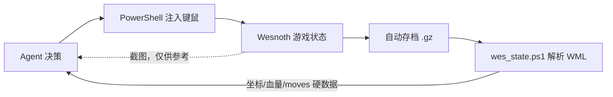

上个周末（9 月 12 日到 13 日），我做了一个实验：用 deepseek harness 玩《韦诺之战》。

规则很简单：Agent 运行在一个 Windows 沙箱里，没有人替它动手。这是一个很老的开源项目，没有为AI设计的操作接口。Agent 能用的只有 PowerShell ——截屏、移动光标、注入键鼠事件，以及读写文件。换句话说，它要像一个只能通过摄像头看屏幕、用机械臂按鼠标的人类玩家一样，自己学会"玩"。

我手头有几个支持多模态的模型
- deepseek-v4.1-flash
- glm-5.3-flash
- kimi-k3

这里我组合使用了几个模型，让它们轮流尝试解决遇到的问题，看看到最后，它们能走多远。

## 第零阶段：搜集信息

对我来说，重点并不是它能玩的多好，而是我尽可能不教它特定知识的情况下，它能自己总结和学会什么。

我让它先去搜索了游戏，然后给它看游戏的安装目录，也给它读了游戏源代码，告诉它先尽可能了解游戏的信息。让它给我总结。

Agent 写出两份研究报告：《1.18 兵种研究》（907 行，覆盖全部种族的转职树、抗性、武器特效）和《地形与战斗机制研究》（397 行，移动消耗、防御率、昼夜加成、领导力公式）。然后是一份 23 关的长期战略：每关的回合上限、胜负条件、隐藏物品（火焰之剑在 19a 的 (29,9)，狮鹫蛋在第 10 关）、支线取舍（05a 陆路优于 05b 海路），以及一套经济模型——

> 每回合收入 = 2 基础 + 2×村庄数；过关金币只结转 40%，但单位 100% 保留。所以**保单位 > 保金币**；提前过关的奖励金大于占着村庄熬回合，所以最优解是"主力速通 + 侦察兵顺路占村"。

这套推理全部来自配置文件的静态分析，一局都还没打。

AI 在这里犯了一个错误，实际上想要可以培养出足够支持长期战斗的队伍，就要从一开始就尽可能训练出一支强大的军队。

这个阶段是 deepseek 自己完成的，速度还算不错，花钱也没有我预想的多。大概只用了几块钱。

## 第一阶段：连游戏的门都摸不到

第一阶段整整 14 轮（goal round），游戏推进为**零**——停在第 1 关回合 4，Konrad 被自家部队堵在城堡里动弹不得。这一阶段它剥离出了 8 个独立的环境根因，每一个都有实测证据：

1. **DPI 缩放 200%**：显卡真实分辨率 2880×1800，Windows 缩放 200%，脚本进程不声明 DPI 感知的话，所有坐标被虚拟化减半——截图只能看到左上角四分之一，点击整体偏移一倍。解法是在进程启动时调 `SetProcessDpiAwarenessContext(PER_MONITOR_AWARE_V2)`。
2. **虚拟桌面隔离**：窗口在非活动虚拟桌面时，`PrintWindow` **仍能截图**（假象一切正常），但输入永远投递不到。
3. **游戏进程"未响应"造成的冻结假象**：卡死的 SDL 窗口持续显示最后一帧，`SetCursorPos` 对任意坐标返回 `False`。此前"视野无法滚动、方向键无效"的结论全是这个假象造成的误判。由此它建立了一条健康自检铁律：每次操作前先 `SetCursorPos(1000,800)`，返回 False 就重启游戏。
4. **窗口太矮裁掉了「结束回合」按钮**：`--resolution 1280x760` 下按钮只剩顶部 11px，对 28 个位置做 2D 网格扫描全部无响应。换成 `--windowed --resolution 1440x960` 才解决。
5. **点击边缘 UI 会触发视野漂移**：「行动」按钮距窗口上边缘只有 22px，点一次视野就向北滚 9~11 行。有次它用「结束回合」按钮滚视野，两次确认框的「否」点失，白白结束了两个回合。
6. **AI 回合要数分钟**：六个 side 轮流行动，期间 UI 锁定。解法是手写 preferences 文件开启 `skip_ai_moves="yes"`，AI 回合瞬间完成。
7. **SDL2 不吃 `PostMessage`**：带修饰键的组合键（Ctrl+R 征募、Ctrl+Space 结束回合）一律无效；可用的只有无修饰单键（ESC、`l` 定位领袖、`n` 下一单位）。
8. **无法验证"操作是否真的生效"**：这是最要命的一条，也是后来一切转机的起点。

第一阶段的最后，它写下一份《最终总结》，结论很诚实：

> 选中有效，移动无效。点击单位所在格能选中，点击空地不产生移动——已排除没选中、没移动力、目的地有友军、地形不可通行、游戏卡死、计划模式、注入方式等全部候选原因……在这个沙箱环境里，用合成鼠标输入驱动该 SDL 游戏做"地图操作"不可靠。

并且附了一份自我批评："前 8 轮有大量时间耗在'盲点乱试'上……最根本的教训是：**应当尽早建立'动作 → 客观验证'的闭环**，否则会长期在'看起来没反应'和'其实有反应'之间打转。"

但是实际上，它的探索非常有限，这里有很多结论都是不完整的。

## 转折点：存档就是上帝视角

DS4F 最终在游戏存档里找到了一些线索。Wesnoth 的自动存档是 **gzip 压缩的 WML 文本**，解压后可以直接解析出关卡名、难度、金币，以及每个单位的 `type / id / x / y / hitpoints / experience / moves / attacks_left`。`wes_state.ps1` 这个"存档状态读取器"成了整个系统唯一可信的事实来源：

闭环一建立，误判立刻现形。比如之前断言"地图点击无效"，真相是**侧栏格读数显示的是光标所在格，不是选中单位所在格**——光标停在视图中央，读数就永远不变，看起来"什么都没发生"。用「保存游戏」生成回合中途存档对比，才发现 Konrad 其实早就从 (20,23) 走到了 (19,23)，`moves` 从 6 变成 5。移动机制一直是通的，是它的"眼睛"骗了它。

更大的发现是 **goto 机制**：点击一个超出本回合移动力的格子，游戏会把它记为跨回合行军命令，之后每回合自动走。这意味着 Agent 不必每回合精确点击十几次——甚至可以直接**编辑存档**，把 goto 目标写进 WML 再 gzip 回去载入，实现全军自动行军。到这一步，它已经从"用机械臂点鼠标"进化到"直接给游戏下指令"了。

但是 deepseek 在这里，并没有真正的解决问题，它一直沉迷于通过存档解析游戏，然后goto。我等了很久，它仍然没有寸进。于是我切到了 GLM，让它总结之前的工作，想办法继续。

GLM 在 DSH 里并没有表现出任何水土不服，相反它通过看截图就准确的找到了各种操作，并且实现了deepseek一再确认没有能力解决的精准点击操作。很快，GLM就进入了真正的游戏策略思考。

## 第 1 关：压哨逃脱

《受困的精灵》要求 14 回合内把 Konrad 从东南城堡送到西北角的路标 (1,1)，中间横着一条河和三个兽人军阀。第一次尝试中，Delfador 的 goto 寻路选了一条"最短路线"，恰好穿过敌方巡逻区——5 点移动力的老法师被带进伏击圈，只能读档修复。

最终方案：起手在城堡招 2 战士 + 1 弓手 + 1 萨满（金币 120→60），全军 goto 沿**西线**（盟军精灵控制区）北上绕开兽人营地，最后 6 格手动点到路标。**8 单位零伤亡，第 13 回合（上限 14）压哨抵达**，剩余金币按 40% 结转到下一关。

精灵萨满是攻击力微弱，升级困难，但是是有用的辅助者，发展潜力极大。其他精灵兵种，随着升级也有很大提升，AI的路线过于着重完成眼前的任务，为长期的发展埋下了隐患。

## 第 2 关：黑水港的学费

《黑水港》是 12 回合的守城战，6 名第一关存活的老兵全部召回参战。这一关交了两次学费：

- 兽人的"**掠夺金库**"事件把金币从 146 直接吸到 15——被动龟守等于慢性自杀，必须主动出击占村；
- Fighter-9 战死，成为整场战役第一个阵亡单位。

但城守住了，还获得了忠诚单位 Haldiel，解锁了骑兵招募——我之前给它提过要求：培养一两个骑兵。这条要求它一直记着，后来骑士埃索丁在第 3 关用长枪冲锋反杀狼骑，算是这条支线的成果。

但是我多年没有再玩过这个游戏的情况下，第二关也可以轻松训练出好几个二级的兵种，如果AI发现了长期的目标，它应该会设计出不同的战术。

## 第 3 关：奥渡因岛泥潭

然后战役停在了《奥渡因岛》。25 回合内击杀兽人领袖乌萨达，敌方开局拥有几乎全部村庄，夜间攻击性 0.75（超激进）。从第 1 次尝试到最后，日志里完整记录了五种死法：

1. **run#3**：goto 远征夜间行军（敌方 +25%），穿过 (10,24) 伏击圈，Konrad 中毒 32→5 阵亡；
2. **run#4**：龟守 8 回合零阵亡，但第 8 回合 Konrad 主动攻击狼骑，13 血被围殴致死；
3. **run#5**：龟守 + 存档传送，触发 AI 全图追猎，回合 10 全灭；
4. **run#6**：骑师冲锋反杀双狼骑，但弓手、萨满、战士在回合 8~11 相继阵亡，Konrad 剩 6 血被困；
5. **run#7**：存档编辑把敌领袖血量改成 1、把 Konrad 传送到相邻格——结果传送目标格被敌方咕噜兵哈尔戈占据，斩首失败。

### 数学给出的唯一解

十余次尝试后，它在日志里做了总结：

- **龟守必败**：城堡仅 7 格，满员 = 无招募 = 无经济，外圈格被逐个点杀；
- **逃跑必败**：狼骑 8 点移动力全图追猎，夜战敌方 +25%；
- **唯一窗口是速攻斩首**：领袖营地距出发点仅 6~7 格，开局守军极少。回合 1 满编 8~9 单位，回合 2~3 抵达，回合 3~6 集火——Delfador 闪电 14×4 魔法 70% 命中，期望每轮约 39 伤，三轮 59 > 领袖的 58 血。拖到回合 10+ 敌人招募成型就必败（已实证）。

这个判断我认为是对的。但它卡在了一个更朴素的问题上：**"全军集团冲锋"需要协调 8 个单位的精确点击，而每步点击都要截图验证落点**，效率不足以支撑这个战术窗口。到第 30 轮收尾时，进度定格在 2/23。

当我在 DSH 中询问游戏进度如何时，GLM 停下来总结了上面的几种情况，主动终止了任务。

但是，它仍然没有认识到，第三关的问题，也许正是来自它手上没有任何值得征募的高级单位。

还有一个很要命的事情，AI 总是不重视占领尽可能多的村庄来发展经济。即使我在中途插入了这方面的提示，仍然执着于尽快完成当前关卡。而人类玩家很多时候更喜欢尽可能培养出高级单位。

## 它给自己写的操作手册

整个过程中最有意思的产出，是它在 9 月 13 日给自己修订的一份《自动操作手册》——一份"写给下一轮的自己"的遗书式文档，因为 DSH 的 goal round 之间它并不记得细节，一切经验都必须落盘。摘录几条：

> - 悬停读数 = 光标所在格；确认选中请用点击后立刻看该格坐标，或直接结束回合解析存档。
> - 「行动」菜单会位移：有「撤销」行时各项下移约 31px。每次先截图再点。
> - ESC = 弹「退出」确认框，不是关闭菜单。
> - 缩小到全图可见后边缘滚动彻底失效，且地图最上面两行被状态栏遮住——第 1 关的路标 (1,1) 就这样点不到。要到达地图边缘的格子，不要靠缩小。
> - 每换一关、每换一次缩放、每改一次窗口大小，都必须重新标定坐标。
> - 停车点固定在窗口内右侧边栏上方 (1150,640)——彻底消除边缘滚动漂移。

这是 GLM 非常了不起的一个成就，它突破了卡死 deepseek 的瓶颈。

## 回顾

两天，三十轮，2/23 关。成果清单：

| 类别 | 产出 |
|---|---|
| 战绩 | 第 1 关（13/14 回合压哨，零伤亡）、第 2 关通关；第 3 关最优进度回合 9~10 |
| 文档 | 13 份：研究报告 ×2、长期战略、操作手册、控制问题记录（47KB）、战役日志、最终总结…… |
| 工具 | 20+ 个 PowerShell 脚本：DPI 修复、存档解析、坐标标定、一键结束回合、goto 编辑…… |
| 方法论 | 动作→验证闭环、健康自检、双源交叉验证、时间线管理纪律 |

## 再一次

在这之后，我切回 deepseek，让它读取前面两轮的探索。这次，deepseek 成功的学会了 GLM 操作游戏的方法，它终于也可以玩游戏了。

Deepseek 在策略方面，比 GLM 更聪明一些，它发现第三关的失败源于第二关没有处理好。于是它反复倒回去探索是否有更好的玩法。

这种大规模回溯能力，在很多运筹学或控制领域，都是非常可贵的。但是很遗憾，一直到我终止游戏，Deepseek 仍然没有找到如何有效的征募和培养单位的策略。

在这个过程中，我实际上几次插入了 kimi k3 和 k2.8 preview，但是无论哪一种，都只会快速耗光5小时额度。我甚至还专门切到了 kimi 客户端。但是仍然无法抗住消耗。所以整个实验最有价值的收获，都来自 deepseek 和 glm。特别是 GLM，表现出了非常好的复合能力。

还有一个非常好笑的事情，deepseek在学习了 glm 的debug过程后，自己悟出了修改游戏存档直接达成胜利的玩法。当我发现不对叫停的时候，它已经快速“打通”了九关。

邪恶大肥鱼名不虚传。

## 新道路

这几天，我让 GLM 为韦诺之战写了一个内嵌的 rpc ，让 DSH 可以绕过视觉识别，直接理解和操作游戏。但是很遗憾，AI并没有因此获得更大的进展。

从这个实验看，今年的 LLM，已经初步的有了动态规划的能力，自发的涌现出强化学习的行为。但是如果没有人类成系统的指导，它仍然不能有效的解决这种长期的策略问题。

现在我们可以看到，前沿的研究者已经获得了很多进展，例如人类数学家很久没有攻克的难题。我相信对我手头这些“民用”级别的模型稍加调教，它们在DSH这样的环境里也能比较顺利的玩战棋游戏。接下来，我会往这个道路上，再做一些尝试。