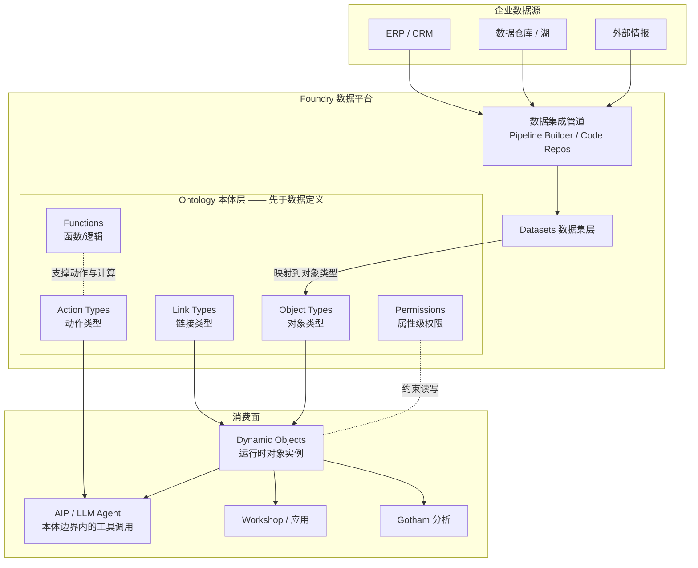
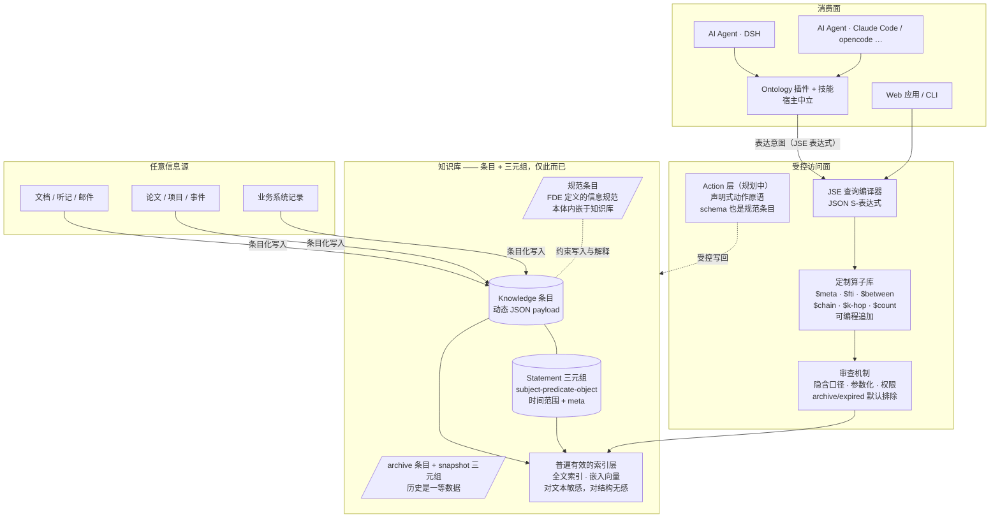
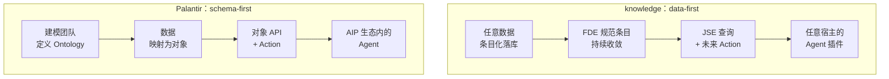

ontology 来自希腊语：

- ontos：存在者、存在的东西
- logos：研究、学说

现代软件行业为它带来了新的含义。Palantir 为 AI 引入了基于 Ontology 的非线性 Agent 架构。

在某种意义上是一种巧合，今年我们团队也实现了一个类似的系统，甚至可以说，两者在内核上殊途同归。

## 基本架构和项目总览

Knowledge 项目是基于常规开发技术从零开发的，因此也没有从一开始就齐备的所有特性。在半年来的开发过程中，我们力求在优先满足业务项目需求的前提下实现项目的稳定发展，同时让每一步都通向整个系统的长期目标。

整个系统由四个要素构成：图模型（存储形态）、JSE 查询系统（访问面）、Action（写侧，规划中）与 Ontology 插件系统（产品分发形态）。下文逐一展开，并在每个要素上说明它与 Palantir 对应物的相似与区别。

## 归一化的图模型

知识库中既包含描述知识的通识信息，也包含业务数据，但存储层只有两种单元：

1. **信息条目（Knowledge）**：一条记录就是一个条目，key 唯一，payload 放在 `content` 与 `meta` 中，结构是动态的 JSON。人物档案、论文摘要、发展建议、招生规则，任何可描述的信息都以一致的方式存储。
2. **三元组（Statement）**：条目之间的关系用 `subject - predicate - object` 表达，附带时间范围（start/end）与元数据。人物→导师、论文→作者、条目→快照归档，全部是同一种边的形态。

```text
任意业务对象  →  一个条目（动态 JSON payload）
任意关系      →  一条三元组（可带时间与来源）
整个数据库    →  条目表 + 三元组表，仅此而已
```

知识条目的外壳是稳定的。它有与内容无关的 `key`，有 `start` 和 `end` 表示的生效区间，内部是两块 JSON——`meta` 放名称、类别、标签、权限和访问范围，`content` 放任意内容。学生档案、谓词定义、文档抽取结果、信息规范，都可以落进同一套外壳；业务差异留在 JSON 内部，不靠为每一种结构再开一张表。

关系同样不另起一套模型。三元组只记录 `subject`、`predicate`、`object`，再携带自己的 `meta` 和时间区间。主体、谓词、客体本身都是知识条目；谓词也不是一列写死的枚举，而是知识库里类别为 `predicate` 的节点。于是"谁与谁存在什么关系"和"这个关系本身如何定义"处在同一张图上，信息结构被收成条目，再被收成边上的三元组。

图数据库是存在已久的品类，knowledge 没有再造一个专用图引擎，而是基于关系数据库：条目和三元组是表，多跳与递归遍历由应用层编译成 PostgreSQL 的递归查询。

具体业务数据的 Schema 也表达为一种数据：`meta.category`、`meta.tags`、`meta.properties` 承载分类与规范，条目自描述。新增一类信息，不需要 DDL，不需要迁移，只需要按约定写条目。这就是"归一化"的含义——不是把万物强行塞进一个固定形状，而是把万物的形状描述也当作数据。

对每一个具体的业务，这种完全动态的体系显然不如静态的业务表有效，但它用极低的技术成本提供了易于 AI 理解的信息集合。

### 普适的检索能力

既然结构是动态的，索引和检索怎么办？是不是每来一类新结构就要重建检索管线？

这里依赖一个观察：全文检索与嵌入向量都对文本本身高度敏感，而对文本之外的结构几乎不敏感。一条人物档案和一条项目记录，字段名可以完全不同，但只要它们有文本，BM25 全文检索就同样有效；embedding 模型把文本映射到语义空间，根本不关心这段文本当年是以什么 JSON 形态存进来的。

所以检索层可以一次建设、普遍覆盖：全文索引、向量索引对所有条目一视同仁，新信息结构落库即入索引。结构信息（分类、标签、关系）则交给三元组与条件过滤去补足精度。动态性与检索能力在这里并不冲突——结构自由交给存储，检索能力交给文本，两者天然解耦。

### 与 Palantir 对象图的相似与区别

两者最终都把业务世界呈现为一张对象—链接图，都承认关系是一等公民，都靠图上的遍历支撑分析（Palantir 的 link/relationship analysis，knowledge 的图浏览与 `$chain`/`$k-hop`）。

区别在类型的地位。Palantir 的对象类型是编译期事实：类型系统定义在数据之前，对象必须先有类型才存在，属性集由 Ontology 固定。knowledge 的类型是运行期约定：条目先存在，类型（category/tags/规范条目）是它身上的描述。Palantir 用类型换取强校验与 IDE 级的建模工具，knowledge 用最小承诺换取接入速度和扩展空间。一张新表、一类新文档，在 Palantir 是一个建模项目，在 knowledge 是一次写库。

## JSE 查询接口——可控的万用入口

存储归一之后，接口层才是 ontology 路线的真正分野。knowledge 对 AI 的答案是 JSE（JSON S-Expression）查询语言：

- AI 不直接写 SQL。它把查询意图表达为 JSON 形式的 S 表达式，例如按条件过滤、投影字段、分组计数、图上展开；
- 后端的应用层负责把这个表达式编译为实际执行的查询（参数化 SQL），并强制套用权限、archive/expired 等隐含口径。

这个设计的核心取舍是：强制 AI 只能进行有限的访问，但这段有限空间内的表达能力足够灵活。

有限，意味着安全与可审计。AI 摸不到任意 SQL，做不了 JOIN 任意表、DROP、绕过行级权限这类事；每一次查询都是一棵可序列化、可记录、可审查的表达式树。

灵活，意味着 AI 依然能完成真正的探索。条件组合（`$and/$or/$not`）、比较与集合算子、JSONB 深层过滤、全文匹配、聚合投影、图遍历，都在同一个表达式体系内完成。AI 会思考，但它的思考只能落在被驯服的语法里。

### 有针对性的抽象，而不是通用图灵机

JSE 的另一层关键是定制化算子。表达式的原子不是 SQL 关键字，而是一组经过抽象提炼的业务算子，例如：

- `$meta` / `$content`：按动态结构的深层字段过滤；
- `$fti` / `$search`：全文检索谓词；
- `$between` / `$expired` / `$unexpired`：时间范围与业务有效期口径；
- `$count` 聚合投影、`$as` 别名、`$triple` / `$chain` / `$k-hop` 关系与图遍历。

这些算子把业务里反复出现的查询模式——按标签找人、数某类条目、查有效期内的人才、沿关系链展开——沉淀为一个词。AI 不必重新发明每个查询的细节，它说"我要什么"，算子决定"怎么算"。

同样重要的是扩展方式：可以通过编程增加必要的算子，而不破坏基本的 JSE 规范和审查机制。编译器在应用层，新算子就是新的编译规则，落点仍然是参数化 SQL 与既有权限口径。表达语言可以生长，信任边界不会松动。这是这条 ontology 路线里"本体可演化"的具体实现——新领域的概念被吸纳为算子，而不是被迫先改数据库。Knowledge 项目的查询接口刻意没有实现循环、逻辑分支、定义，使其始终处于可以静态分析的不完备状态。

### 语义与方言分离

这套设计还有一个经过实践验证的深层收益，来自我们在姊妹项目 hypatia（一个面向 AI 的开源记忆管理系统）中的架构升级经验：JSE 指令集一旦稳定，它就是知识库与存储层之间的契约。

在 hypatia 的重构中，二十个左右的算子语义被逐条翻译，从一套存储方言整体迁移到另一套（DuckDB+SQLite 双库 → 单一 SQLite + 自建 JSON 倒排；后端同样支持 PostgreSQL + pgvector），所有旧数据无损跨过迁移，AI 侧的查询完全无感。工作模式是"人守住语义契约，AI 完成方言翻译"——每个算子的语义（如 JSONB `@>` 等价于 jq 的 `contains()`）被明确写下来，实现可以推倒重来。

这正是 JSE 作为 ontology 访问面优于"让 AI 直接写 SQL"的地方：SQL 查询把语义和方言焊死在一起，换个数据库所有历史查询作废；JSE 查询表达的是意图，存储引擎只是它当前的编译目标。knowledge 平台从 PostgreSQL 单后端起步，未来若引入检索引擎或换存储方案，JSE 层的资产不会贬值。

### 与 Palantir 的相似与区别

Palantir 也不让分析者裸写 SQL 摸底层数据——Foundry 用户通过 Ontology 的对象 API 与受限查询访问数据。两者的访问面都承担安全、审计与抽象三重职责。

区别在组织方式。Palantir 的访问面围绕对象类型组织：查询对象、属性、链接，字段名来自 Ontology 定义。JSE 围绕查询意图组织：条件、投影、聚合、图遍历，字段路径只是数据身上的描述。Palantir 的查询能力随 Ontology 版本演进，由厂商建模团队交付；JSE 的能力随算子库演进，算子可以由本项目编程追加，而审查机制（隐含口径、参数化、权限）独立于算子数量存在。一个是类型安全的封闭查询，一个是契约安全的开放查询。

## 从只读到完整 Ontology 的下一步

目前这套系统是只读的：AI 与应用通过 JSE 读取条目与三元组，写入走受控的服务端管线——规范化的保存管线本身已经带有归档、snapshot 三元组、乐观锁等保障。

要成为完整的 Ontology 系统，缺的是写侧的受控语义，也就是 Palantir 语境里的 Action：把"一次合法的业务变更"定义为一等公民，例如"创建一条人物条目并建立导师关系"、"修改发展建议并自动归档旧版本"。计划中的演进路径：

1. 只读查询面（已完成）：JSE 查询、算子、审查机制；
2. Action 层（下一步）：以声明式规范定义动作的类型、前置校验、副作用（写条目、建三元组、归档快照）与权限；
3. 完整 Ontology：读有查询面，写有 Action 面，规范条目定义两者，形成闭环。

写侧沿用读侧同样的哲学：不开放裸写，而是提供有限的、可校验的、可审计的动作原语。届时 AI 对知识库的整个交互都落在"表达式查询 + 声明式动作"这套受控语法之内。

### 与 Palantir Actions 的相似与区别

两者都拒绝"给模型一个数据库连接让它自己写"，都把业务变更建模为有类型、有校验、有副作用的动作，都要求动作可审计、可回溯。

区别在绑定对象。Palantir 的 Action 类型绑定在 Ontology 的对象类型上，"修改一个 Object 的属性"是核心原语；knowledge 的 Action 预期绑定在规范条目上——动作的 schema 本身也是知识条目（见"信息规范本身也是条目"一节），定义一个新 Action 不需要建模团队发版，FDE 写一条规范条目即可。此外，knowledge 的变更安全模型已经有一套独特的存量约定：修改前旧数据写入 archive 条目、建立 snapshot 三元组、记录 committer。这些在 Palantir 中属于平台备份能力，在 knowledge 中是 ontology 语义的一部分——历史本身是一等数据。

## 信息规范本身也是条目

动态结构容易滑向无政府状态。knowledge 的约束方式不是外置 schema 文件，而是允许 FDE（Forward Deployed Engineer）定义信息规范，并以条目的方式保存在知识库中：

- 一类信息该有哪些字段、哪些分类、哪些标签口径、用什么谓词关联——这些规范本身写成知识条目，进入同一个归一化的底座；
- AI 和数据流程在使用数据前可以（也应该）查询这些规范条目，作为写入与解释的依据；
- 规范的演进就是条目的演进，天然带有历史、归档与 snapshot 三元组追溯。

为了保持业务数据的可理解，Knowledge 的条目总是包含自解释信息。通过 meta.category 和 meta.tags，我们总是可以了解信息的性质。进一步的，对于核心的业务数据，我们提供了 schema 条目做进一步的规范。这种用信息条目解释信息的思路，来自现代应用编程语言如 C#、Java、Python 中普遍存在的 type 对象理念。

这是一种本体内嵌于知识库的自举设计：知识库不仅存事实，也存关于事实应当如何组织的知识。Knowledge 项目中不存在专职的 FDE，但很多工作体现了相关的分工。FDE 贴近业务前线，由他们迭代规范，而这部分工作不需要触及底层架构的修改，比集中式建模团队更快，也不需要一次性的大迁移。

与 Palantir 对比：Palantir 也强调 FDE 文化，但 FDE 在 Foundry 中交付的仍是平台内的 Ontology 对象与流水线配置——本体住在平台里；knowledge 中 FDE 交付的是数据——本体住在知识库里，和它描述的事实共享同一套存储、检索、权限与历史机制。这使得"本体的版本史"和"事实的版本史"是同一种东西。

## Ontology 插件系统——AI Agent 的集成形态

这条路线的终点不是一套文档里的架构，而是可被 Agent 消费的产品形态：ontology 化的插件。

- 每个 AI Agent 宿主（如 DSH）通过 knowledge 插件获得一组语义清晰的工具：条件查询、精确读取、图浏览、搜索、受控保存；
- 插件把 JSE 的纪律带进 Agent 的工作流：先加载查询语言与领域技能，先锚定实体再展开图，计数走聚合而不是数截断页，归档与过期口径由服务端强制。Agent 不需要每次重新学习这些纪律，它们已经被编译进了工具的说明与约束里；
- 由此 AI 对知识库的使用从碰运气的自由文本检索，变成有效且可靠：查询有确定语义，口径有默认保障，写路径（Action 落地后）有校验与审计。

### 与 Palantir 的相似与区别

Palantir AIP 同样把 Ontology 暴露给 LLM Agent——Agent 通过工具调用查询对象、发起 Action，平台负责把模型输出约束到本体边界内。让 Agent 在受控本体上行动，而不是在自由文本上幻觉，是双方共同的信念。

区别在生态形态。Palantir 的 Agent 集成围绕其自家平台闭环（AIP + Foundry），本体与 Agent 运行时在同一厂商体系内；knowledge 的插件是宿主中立的——同一套知识库通过插件接入任意 Agent 宿主（DSH、Claude Code、opencode……）。这个多宿主模式已在 hypatia 上得到日常验证：openclaw、harness、opencode、claude 共享同一记忆库，Agent 之间经由知识库而非会话传递长期信息。ontology 的价值随接入的 Agent 数量增加而复利增长，而不是锁定在单一平台内。

## 信息架构

两条路线的差异，画成架构图最直观。

### Palantir：本体先行的信息架构

Palantir 的信息流是"建模 → 管道 → 对象"：Ontology 在数据接入之前就已定义，一切数据必须穿过建模层才能成为"对象"。



本体是数据的准入条件。新数据源接入等于管道加类型映射的建模项目，类型变更等于 Ontology 发版。本体住在平台里，是系统编译期的一部分。

### knowledge：数据本位的信息架构

knowledge 的信息流是"条目化 → 归一存储 → 受控查询"：本体不是准入条件，而是以规范条目的形式住在知识库内部，与事实共享同一套存储。



本体是数据身上的描述，不是数据的门槛。新信息结构接入等于按约定写条目（可选地先由 FDE 写一条规范条目）；能力演进等于追加算子或插件，存储与契约不动。

### 两条信息流的对照



对照地看：Palantir 的每一步都把世界模型前置——模型先行，数据服从模型；knowledge 的每一步都把世界模型后置——数据先行，模型（规范条目、算子、Action schema）作为数据的一部分持续生长。前者换来的是强校验与企业级确定性，后者换来的是接入速度、扩展空间，以及本体与事实共享同一套版本历史的自洽。

## 路线对照表

| 维度 | Palantir Ontology | knowledge 路线 |
| --- | --- | --- |
| 存储承诺 | 严格的对象/属性/链接类型，本体先行 | 动态条目 + 三元组，最小承诺，本体后置 |
| schema 位置 | 建模阶段前置定义，住在平台里 | 内嵌为规范条目，住在知识库里，FDE 持续演进 |
| 类型性质 | 编译期事实（无类型即无对象） | 运行期约定（条目自描述） |
| 检索适配 | 随本体逐类映射 | 文本索引/向量对文本敏感、对结构无感，天然普遍有效 |
| AI 访问面 | 对象 API + AIP 工具，类型安全 | JSE 表达式 + 定制算子，契约安全、可编译可审计 |
| 算子/能力演进 | 随平台版本由建模团队交付 | 编程追加算子，不破坏 JSE 规范和审查机制 |
| 写侧 | Action 体系（成熟） | 目前只读；Action 以规范条目为 schema，规划中 |
| 变更历史 | 平台备份能力 | archive 条目 + snapshot 三元组，历史是一等数据 |
| Agent 集成 | AIP + Foundry 平台闭环 | 宿主中立的 ontology 插件 + 技能，多 Agent 共享复利 |
| 个人/小规模形态 | 无（企业级产品） | hypatia：同构的轻量记忆系统，思想回流 |

概括成一句话：Palantir 把本体建在系统前面，我们保持数据驱动——存储保持极简与归一，本体能力由查询语言、算子体系、内嵌规范和插件产品逐层供给。对 AI Agent 时代而言，这条路线的赌注是：与其给机器一个庞大而僵硬的世界模型，不如给它们一个可控的有限自动机。
